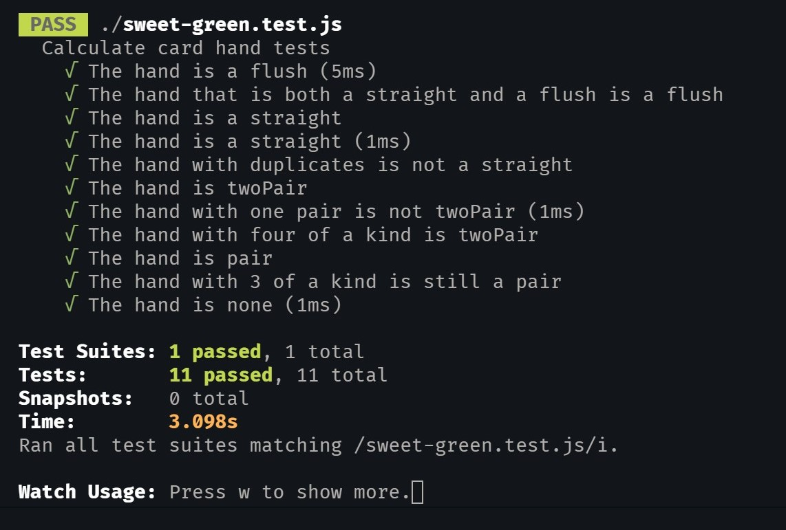

# Sweet Green Exercise

**I included a [typescript version](https://github.com/ralexand56/sg-test/blob/master/sweet-green.ts) and a [javascript version](https://github.com/ralexand56/sg-test/blob/master/sweet-green.js).**

**I setup [jest tests](https://github.com/ralexand56/sg-test/blob/master/sweet-green.test.js) for the stated examples and some other cases.**

## Test Results
